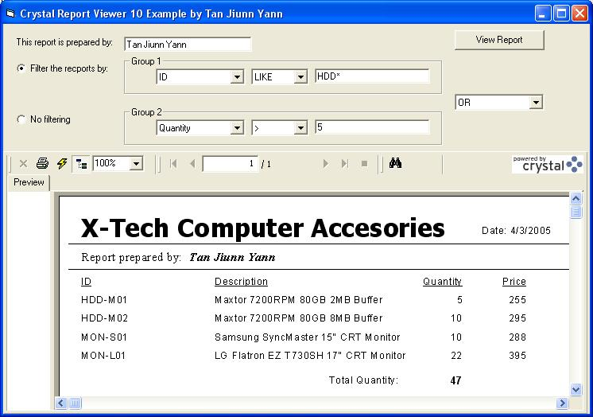



## Crystal Report 10 and VB 6

### Description

This project demonstrates how to open the Crystal Report 10 in VB 6 and assign the path of Access db. to the report file. It has uses some function in the VB, like the Formula, RecordsSelectionFormula....

I weak in commenting the code, but hopefully it help some of you. Please give some comments/ critics and vote to me.

Before opening the project, please make sure Crystal Report 10 is installed in your Windows, otherwise, the project cannot function normally.
 
### More Info
 

             |
---                |---
**Submitted On**   |2005-04-03 10:54:02
**By**             |[Tan Jiunn Yann](https://github.com/Planet-Source-Code/PSCIndex/blob/master/ByAuthor/tan-jiunn-yann.md)
**Level**          |Beginner
**User Rating**    |4.8 (72 globes from 15 users)
**Compatibility**  |VB 6\.0
**Category**       |[Databases/ Data Access/ DAO/ ADO](https://github.com/Planet-Source-Code/PSCIndex/blob/master/ByCategory/databases-data-access-dao-ado__1-6.md)
**World**          |[Visual Basic](https://github.com/Planet-Source-Code/PSCIndex/blob/master/ByWorld/visual-basic.md)
**Archive File**   |[Crystal\_Re187150432005\.zip](https://github.com/Planet-Source-Code/tan-jiunn-yann-crystal-report-10-and-vb-6__1-59818/archive/master.zip)

